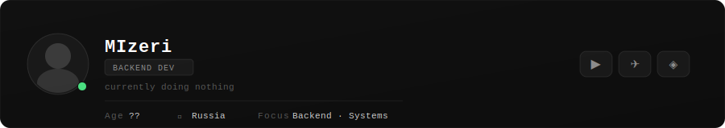
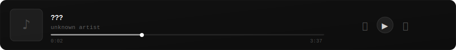

<!-- Если твой реальный GitHub username отличается от "MIzeri", замени его во всех ссылках ниже (stats, top-langs, streak, activity-graph, komarev). -->
<!-- Этот README использует /assets/*.svg — убедись, что папка assets лежит в корне репозитория. -->

 

 

### [ BOOT_SEQUENCE ]

---

### [ SYSTEM_IDENTITY ]

---

### [ ABOUT.LOG ]

---

### [ /skills ]

---

### [ TECH_STACK.SYS ]

---

### [ GIT_METRICS ]

---

### [ ACTIVITY_GRAPH ]

---

### [ NOW_PLAYING ]

<!--
ПРИМЕЧАНИЕ: GitHub README не умеет рендерить живые HTML/iframe-виджеты (как nowplaying.site),
поэтому это кликабельный бейдж-ссылка, а не встроенный плеер.
Если захочешь "живой" авто-обновляющийся трек прямо в README — нужен Last.fm никнейм,
тогда можно подключить lastfm-recently-played и он будет тянуть текущий трек автоматически.
-->

---

### [ LIVE_LOG ]

> this terminal does not close. it only waits.

---

### [ DISCORD_LINK ]

<!--
ПРИМЕЧАНИЕ: для отображения статуса (онлайн/слушает Spotify/в войсе) через Lanyard
нужно один раз зайти на Discord-сервер Lanyard: https://discord.gg/lanyard
Это требование самого сервиса — без этого карточка покажет "user not found / no data".
-->

---

### [ SYSTEM_STATUS ]

